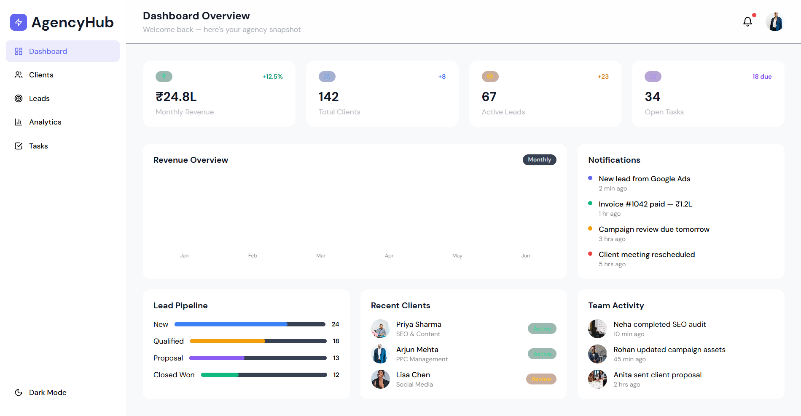
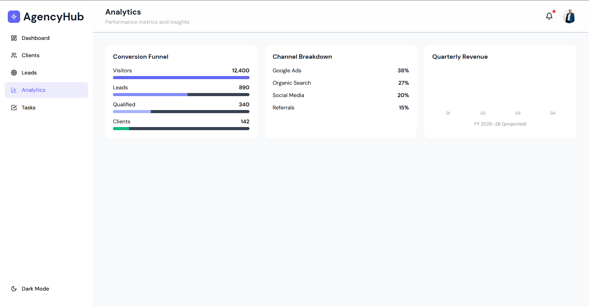
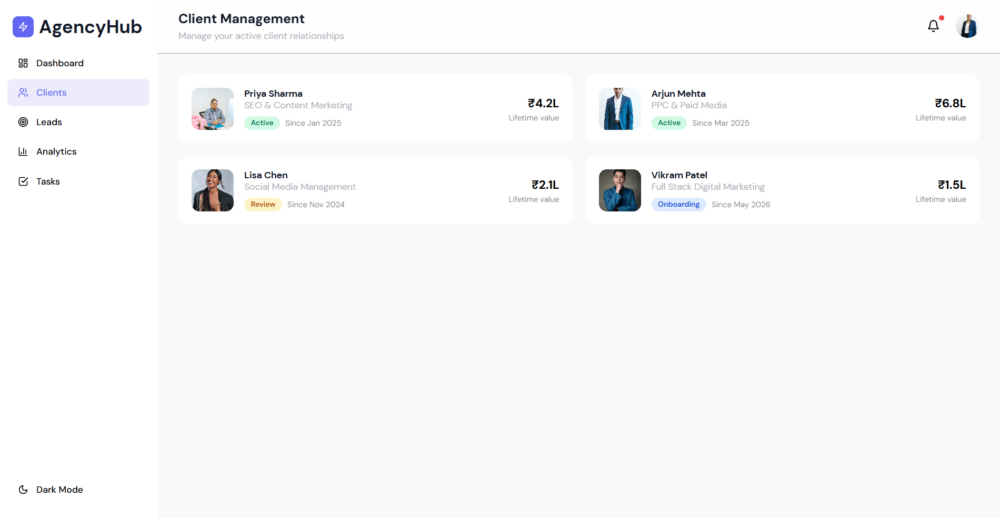

# FUTURE_UX_03 — CRM / Client Management Dashboard UI

## Project Overview

This project is a modern CRM (Customer Relationship Management) dashboard UI designed for a digital marketing agency. The dashboard focuses on improving workflow management, client tracking, analytics monitoring, and overall productivity through a clean and professional SaaS-style interface.

The design follows modern enterprise UI principles with responsive layouts, analytics-focused components, and scalable dashboard structures suitable for real-world agency operations.

---

## Internship Task

### Task 3 — CRM / Client Management Dashboard UI

> Design a CRM / Client Management Dashboard UI for a small agency or B2B service-based business.

This task focuses on:
- B2B SaaS UX design
- Dashboard layout structuring
- Data visualization UX
- Workflow-based UI thinking

---

## Problem Statement

Many CRM dashboards used by agencies and businesses are overloaded with information, difficult to navigate, and lack user-friendly workflow management systems.

Common issues include:
- Cluttered dashboard layouts
- Poor lead tracking systems
- Difficult client management workflows
- Confusing analytics presentation
- Inefficient task management

This project solves these problems by creating a clean, organized, and scalable dashboard interface focused on usability, workflow efficiency, and professional enterprise-level user experience.

---

## Objectives

- Create a modern SaaS dashboard interface
- Improve lead and client management workflows
- Design responsive and scalable dashboard layouts
- Enhance productivity through organized UI components
- Simplify analytics visualization
- Build intuitive navigation systems

---

## Design Style

- Modern SaaS dashboard UI
- Minimal and professional design
- Light and dark mode interfaces
- Clean analytics layout
- Enterprise-level component styling
- Responsive desktop experience

---

## Pages Designed

### 1. Dashboard Overview
Includes:
- KPI cards
- Revenue overview
- Team activity
- Notifications panel
- Analytics summary

### 2. Client Profile
Includes:
- Client information
- Communication history
- Project progress
- Engagement details

### 3. Lead Tracking
Includes:
- Lead pipeline
- Status indicators
- Lead categories
- Progress stages

### 4. Analytics Dashboard
Includes:
- Revenue charts
- Performance graphs
- Campaign analytics
- Team productivity metrics

### 5. Task Management
Includes:
- Task reminders
- Workflow tracking
- Priority indicators
- Calendar integration

---

## Dashboard Features

- Lead pipeline management
- Client management system
- Revenue analytics charts
- Team activity tracking
- Notifications panel
- Sidebar navigation
- Modern cards and charts
- Responsive layouts
- Light and dark mode support

---

## Design Process

### Research
- Analyzed modern CRM and SaaS dashboards
- Studied workflow management systems
- Explored analytics-based UI patterns

### Wireframing
Created dashboard structures for:
- Analytics overview
- Client management
- Task workflows
- Lead pipelines

### Visual Design
Applied:
- Clean card-based layouts
- Modern sidebar navigation
- Data visualization components
- Consistent spacing and typography

### Responsive Design
Optimized layouts for:
- Desktop screens
- Large displays
- Responsive dashboard behavior

---

## User Flow

```text
Dashboard Overview
   ↓
Lead Pipeline
   ↓
Client Profile
   ↓
Task Management
   ↓
Analytics Monitoring
```

---

## Tools Used

- Canva
- Miro
- Google Fonts
- Coolors
- GitHub

---

## Design Inspiration

Reference Website:
https://selfcare-salon.my.canva.site/agencyhub-webapp

Inspired by:
- HubSpot
- Monday.com
- Salesforce
- Notion
- Modern SaaS dashboard interfaces

---

## Screenshots

### Dashboard Overview
()

### Analytics & Lead Pipeline
()

### Client Management
()

---

## Design Link

(https://selfcare-salon.my.canva.site/agencyhub-webapp)

---

## Key UX Decisions

- Used sidebar navigation for efficient workflow management
- Applied clean visual hierarchy for better readability
- Designed analytics cards for quick data access
- Added dark and light mode for accessibility and usability
- Organized dashboard sections to reduce information overload

---

## Learning Outcomes

Through this project, I learned:
- SaaS dashboard UI/UX design
- CRM workflow structuring
- Data visualization principles
- Enterprise-level interface design
- Dashboard usability optimization
- Responsive desktop dashboard layouts

---

## Author

### Ayesha Sabahath
UI/UX Design Intern — Future Interns

GitHub: (https://github.com/AyeshaSabahath)
LinkedIn: (linkedin.com/in/ayesha-s-836673337)

---

## Acknowledgement

This project was completed as part of the UI/UX Design Internship Program by Future Interns.